🎟️ Event Ticket Booking and Management System

A Java Swing desktop application for managing events, users, ticket bookings, payments, and reports using Java, JDBC, and MySQL.

👥 Project Team

Name

Roll No.

Nainsi Yadav

SYCS54

Shrishti Pandey

SYCS33

📌 Project Overview

The Event Ticket Booking and Management System is a Java-based desktop application developed using Java Swing, JDBC and MySQL.

The system has two main roles:

👨‍💼 Admin

The administrator can:

Login to the system

Add, view, update and delete admin records

Manage users

Manage events

Manage bookings

Manage payments

View reports and analytics

👤 User

The user can:

Register an account

Login

View available events

Select ticket types

Book tickets

Make/view payment records

View personal bookings

🛠️ Technologies Used

Technology

Purpose

Java

Main programming language

Java Swing

Graphical User Interface

JDBC

Connects Java with MySQL

MySQL

Database

MySQL Connector/J

JDBC driver

VS Code

Source-code editing / project development

🏗️ System Architecture

The project follows a layered structure:

GUI Layer
   ↓
Service Layer
   ↓
Model Layer
   ↓
JDBC / DBConnection
   ↓
MySQL Database

GUI Layer

Contains Swing forms, login pages, dashboards and management screens.

Service Layer

Contains business and database operations such as add, view, update, delete, login and reporting.

Model Layer

Contains data classes such as User, Admin, Event, Booking and Payment.

Interface Layer

Defines the operations that are implemented by service classes.

Database Layer

DBConnection.java creates the JDBC connection to MySQL.

🧩 Custom Java Interfaces

The project contains six custom interfaces:

AdminOperations

UserOperations

EventOperations

BookingOperations

PaymentOperations

ReportOperations

These interfaces provide abstraction and define the operations implemented by the service classes.

Interface → Service Mapping

BookingOperations → BookingService
EventOperations   → EventService
UserOperations    → UserService
PaymentOperations → PaymentService
AdminOperations   → AdminService
ReportOperations  → ReportService

🗄️ Database Design

The project uses MySQL with related tables for the booking system.

Main Entities

Users

Admins

Events

Ticket Types

Bookings

Payments

Important Relationships

Users
  ↓
Bookings
  ↓
Payments

Events
  ↓
Ticket Types
  ↓
Bookings

Foreign Keys

Foreign keys connect the modules. For example:

bookings.user_id        → Users
bookings.event_id       → Events
bookings.ticket_type_id → Ticket Types
ticket_types.event_id   → Events
payments.booking_id     → Bookings

This maintains relationships between records.

Important: The current project package contains the JDBC driver and Java source code, but it does not contain a separate SQL database dump. Before running the project on another computer, the required MySQL database/tables must be created or imported from the existing project database.

🔌 Database Connection

The project uses JDBC through:

database/DBConnection.java

The connection is configured for:

Host: localhost
Port: 3306
Database: event_ticket_db
User: root

The local development password is configured inside DBConnection.java.

⚠️ Do not publish your real database password on GitHub. Replace it with a local value before making the repository public.

🔄 CRUD Operations

CRUD means:

Create – Insert new records

Read – Display/retrieve records

Update – Modify existing records

Delete – Remove records

CRUD is implemented through the service classes.

Module

Create

Read

Update

Delete

Admin

Add Admin

View Admins

Update Admin

Delete Admin

User

Add User

View Users

Update User

Delete User

Event

Add Event

View Events

Update Event

Delete Event

Booking

Add Booking

View Bookings

Update Booking

Delete Booking

Payment

Add Payment

View Payments

Update Payment

Delete Payment

SQL operations are executed using JDBC and PreparedStatement.

🎟️ Booking Workflow

The main booking flow is:

Login
  ↓
View Events
  ↓
Select Event
  ↓
Select Ticket Type
  ↓
Enter Quantity
  ↓
Check Availability
  ↓
Create Booking
  ↓
Payment
  ↓
My Bookings

The booking process validates the related user, event and ticket type and checks ticket availability.

The booking amount is based on:

Ticket Price × Quantity

💳 Payment Module

The payment module stores information related to a booking, including:

Booking

Amount

Payment Method

Payment Status

Payment Date

Available payment methods in the application include:

UPI

Card

Cash

Net Banking

📊 Reporting and Analytics

The ReportService and ReportForm provide summaries such as:

Total Bookings

Total Revenue

Popular Event

Event-wise Revenue

Payment Status Summary

The reporting module uses SQL aggregation such as COUNT, SUM, grouping and joins.

🧠 OOP Concepts Used

Encapsulation

Model classes use private fields with getter and setter methods.

Abstraction

Custom interfaces define operations without exposing their implementation details.

Polymorphism

Service classes implement interface methods using @Override.

Classes and Objects

The project uses model, service and GUI classes to organize data and functionality.

Separation of Concerns

GUI, service, model, interface and database responsibilities are separated into packages.

▶️ How to Run the Project

Step 1 – Install Java

Install a compatible JDK and check:

java -version
javac -version

Step 2 – Install MySQL

Install MySQL Server and MySQL Workbench.

Make sure the MySQL server is running.

Step 3 – Create/Import the Database

Create/use the database expected by the application:

event_ticket_db

The required tables must be present before running the application.

If you already have the working database on your computer, use that database.

For sharing the project with another person, export the SQL database from MySQL Workbench and add the SQL dump to the GitHub repository, for example:

database/event_ticket_db.sql

Then the user can import that SQL file into MySQL.

Step 4 – Check DBConnection.java

Open:

src/database/DBConnection.java

Check:

URL      = jdbc:mysql://localhost:3306/event_ticket_db
USER     = root
PASSWORD = your-local-mysql-password

Use your own local MySQL password.

Step 5 – Check MySQL Connector/J

The project already contains:

lib/mysql-connector-j-9.7.0.jar

Make sure this JAR is added to the Java project's classpath.

Step 6 – Run the Application

Run:

src/gui/MainLogin.java

The main login window should open.

From there:

Admin Login
     ↓
Admin Dashboard
     ↓
Manage Users / Events / Bookings / Payments / Reports

or

User Registration/Login
     ↓
User Dashboard
     ↓
View Events
     ↓
Book Ticket
     ↓
Payment
     ↓
My Bookings

📸 Screenshots

All screenshots are kept exactly with the existing names: image1.png, image2.png, ... image14.png inside src/screenSorts/.

## 🖼️ Project Screenshots

### Image 1

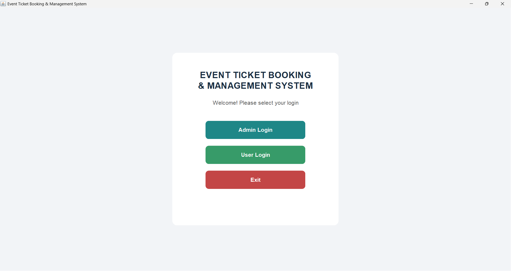

### Image 2

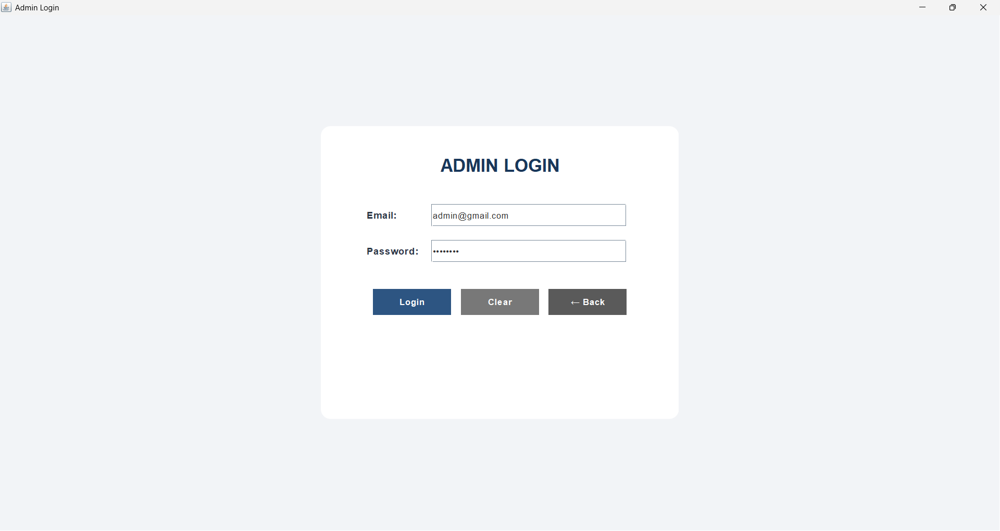

### Image 3

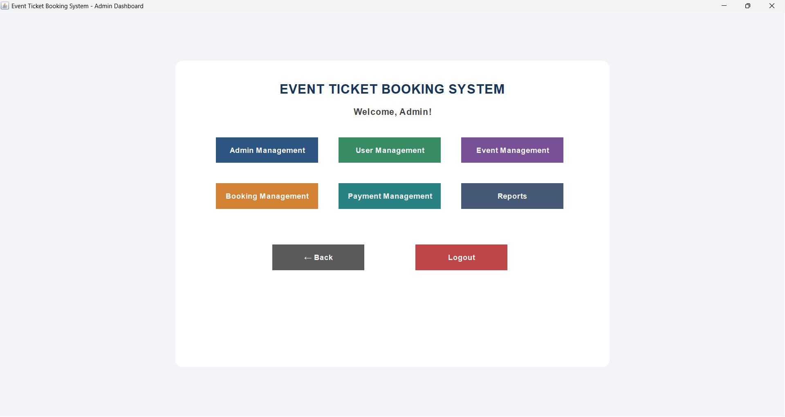

### Image 4

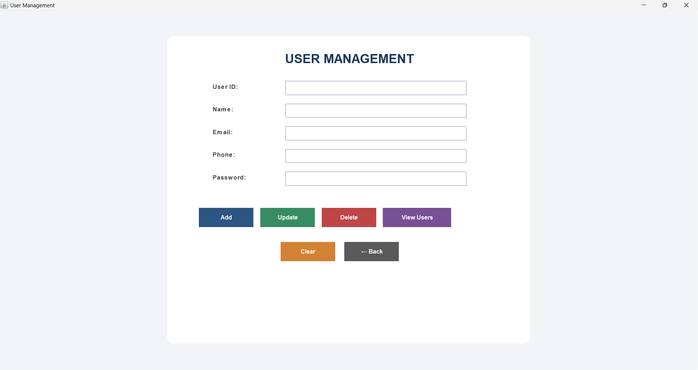

### Image 5

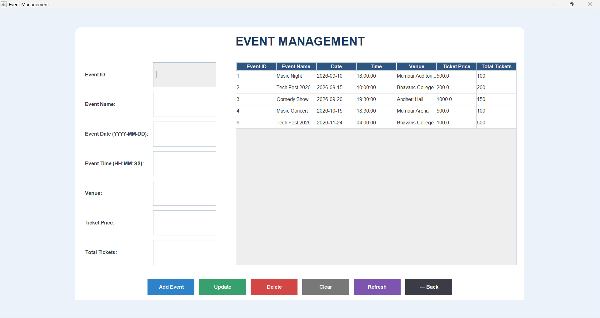

### Image 6

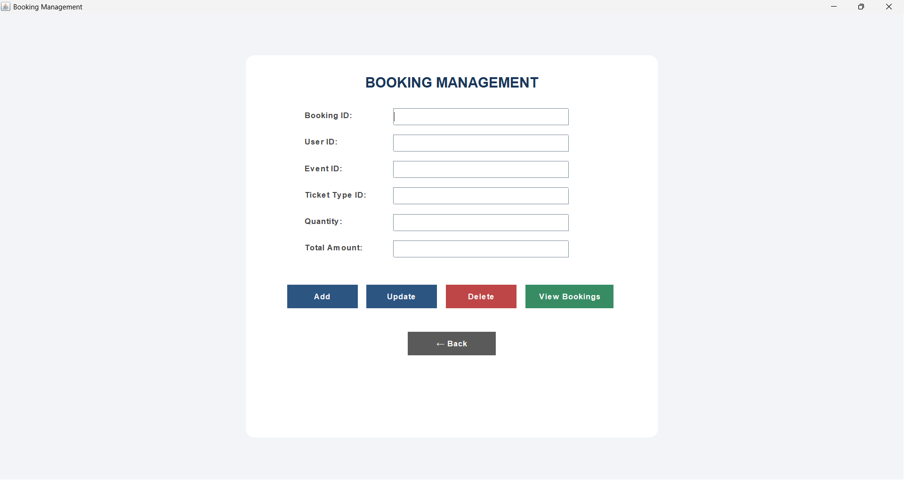

### Image 7

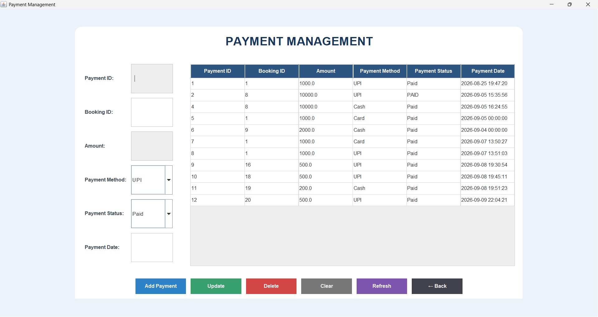

### Image 8

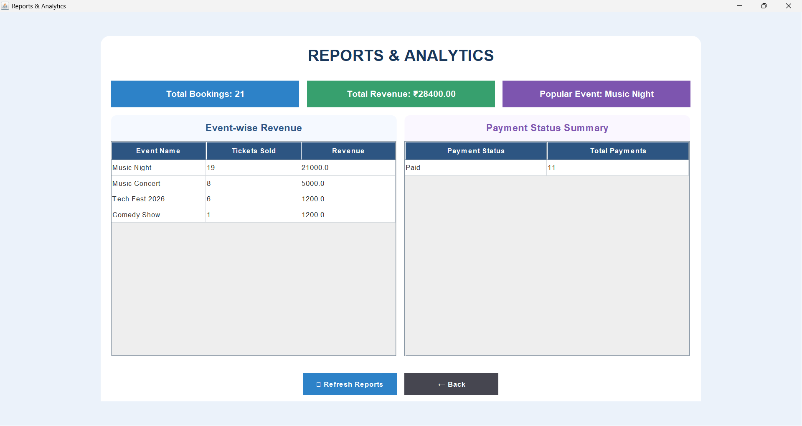

### Image 9

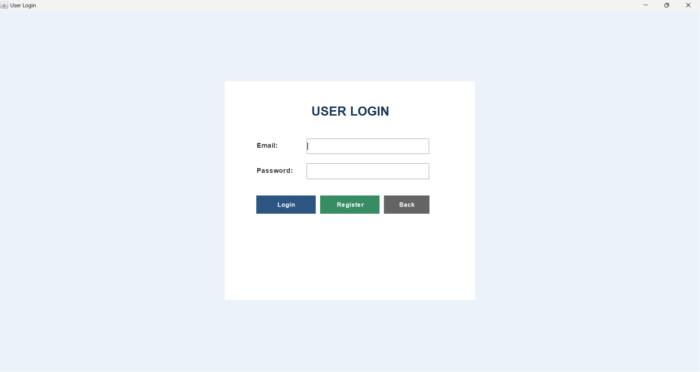

### Image 10

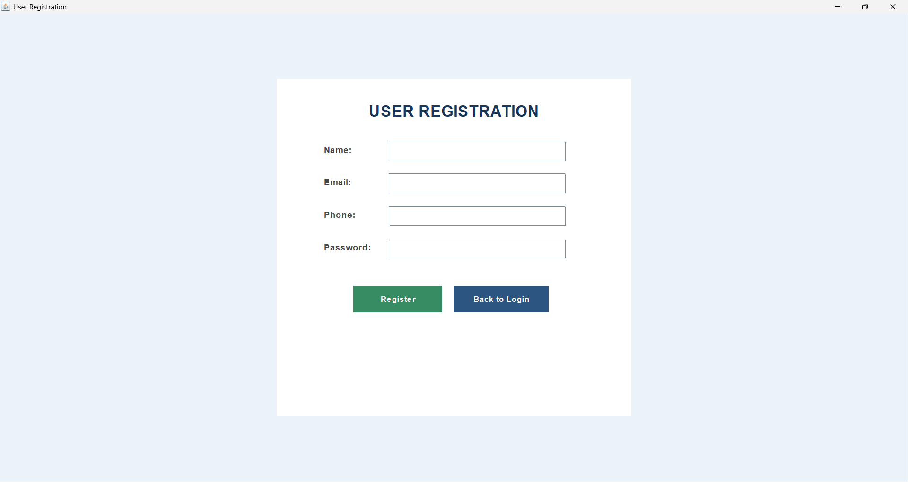

### Image 11

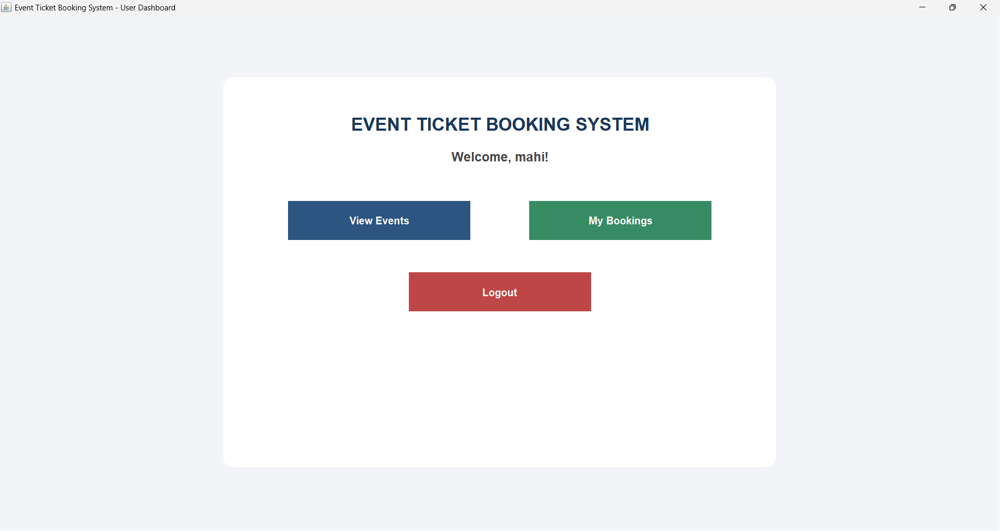

### Image 12

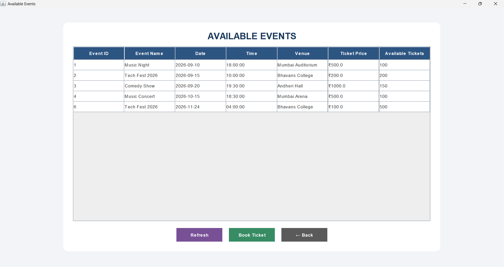

### Image 13

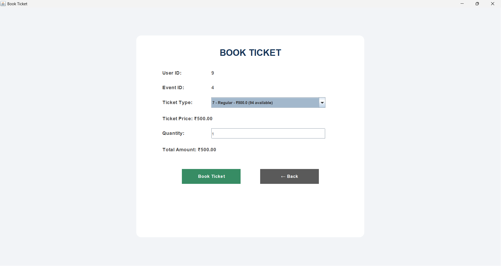

### Image 14

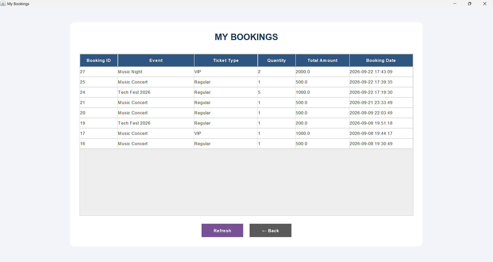

✅ Project Features Summary

Java Swing GUI

Admin Login

User Registration and Login

Admin Management

User Management

Event Management

Ticket Booking

Payment Management

My Bookings

CRUD Operations

JDBC and MySQL Connectivity

Six Custom Java Interfaces

Foreign Key Relationships

Booking Validation

Transaction Handling

Reporting and Analytics

OOP-based layered architecture

👩‍💻 Authors

Nainsi Yadav – SYCS54
Shrishti Pandey – SYCS33

Event Ticket Booking and Management System

Java + Swing + JDBC + MySQL
